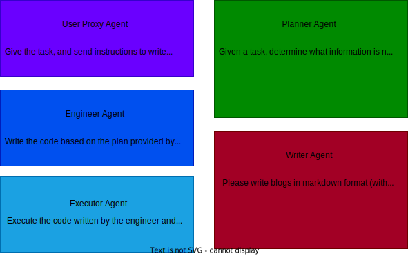

# Autogen Group Chat Example

This project demonstrates how to use the Microsoft `autogen` framework to create a group of AI agents that collaborate to complete a task. In this example, the agents work together to write a blog post about the stock price performance of Nvidia for the past month.

## Overview

The project is built around a **group chat** of specialized agents, each with its own role. The agents collaborate to complete the given task using natural language and code execution.

### Agents Involved

1. **Admin (User Proxy)**: This agent allows the user to give instructions, review, and provide feedback on the blog post.
2. **Planner**: Determines the information needed to complete the task and manages the progress.
3. **Engineer**: Writes Python code based on the planner's instructions.
4. **Executor**: Executes the code written by the engineer and reports the results.
5. **Writer**: Writes the blog post based on the executor's results and refines it based on feedback from the Admin.

## How It Works

1. **Task**: The system is tasked with writing a blog post about Nvidia's stock price performance over the last month.
2. **Group Chat**: The agents collaborate in a chat-based environment where:
   - The **Admin** initiates the task.
   - The **Planner** breaks down the task into smaller steps, identifying what information is needed to complete it.
   - The **Engineer** writes Python code based on the planner's plan.
   - The **Executor** runs the code and provides the results.
   - The **Writer** drafts the blog post using the information provided by the **Executor**, and iterates based on feedback from the **Admin**.

### Example Use Cases

You can use this structure for various collaborative AI tasks, such as:
- Automating report generation.
- Performing data analysis with Python code execution.
- Building conversational workflows with multiple specialized agents.

## Getting Started

### Prerequisites

- Python 3.7+
- An OpenAI API key (you can get one [here](https://platform.openai.com/))

### Installation

1. Clone the repository:
   
       git clone https://github.com/your-repository/autogen-groupchat-example.git
       cd autogen-groupchat-example

2. Install the dependencies:
   
       pip install -r requirements.txt

3. Optionally install a dependency the agents will likely use. Note: You don't have to do this ahead of time as the agents will try to install it themselves using pip. However you may wish to do this especially if the agents run into trouble using pip such as if pip is not in path:
   
       pip install yfinance

4. Set up your OpenAI API key:
   
       export OPENAI_API_KEY="your-api-key-here"

### Running the Code

Once the dependencies are installed and your API key is set, you can run the script:

    python main.py

The script will initialize a group chat of AI agents, and the **Admin** agent will begin by giving the task to write a blog post about Nvidia's stock performance.

### Output

The system will produce a markdown blog post that includes:
- Analysis of Nvidia's stock price over the past month.
- Any code execution and results based on the data retrieved during the process.

## Reference

This code is based on an example from the [AI Agentic Design Patterns with Autogen](https://learn.deeplearning.ai/courses/ai-agentic-design-patterns-with-autogen) course by DeepLearning.ai.

## License

This project is licensed under the MIT License. See the [LICENSE](LICENSE) file for more details.
